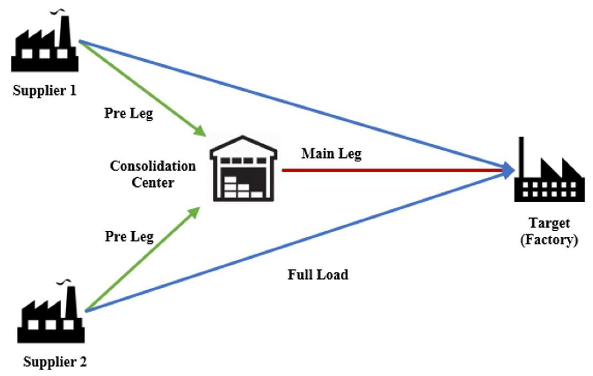

# Inbound Logistics Forecasting

[Forecasting System for Inbound Logistics Material Flows at an International Automotive Company](https://www.mdpi.com/2673-4591/39/1/75)

The problem at hand refers to forecasting the inbound material flows on monthly basis for the next 4 months. Material volume moves from the consolidation centers to the plants via the main legs in and a Area Forwarding-based Inbound Logistics Network, as explained in the following image:

The idea is to create a forecasting system which is robust to adapt for outliers and unexpected events; as well as taking into account for the cost penalization when under- and overforecasting. Underforecasting means that the predicted value is actually lower than the realized value; in this case, *ad hoc* transportation must be arraged. *Ad hoc* transportation cost as high as 1500 USD per ton. On the other hand, overforecasting might produce warehouses to fill up too fast, and additional warehouses might be needed. In general, for this problem one can consider a cost of 150 USD per ton caused by overforecasting (Here tons instead of cubic meters are use in order to simplify the problem).

The test timeframes are: 
- Jan 2019 - Apr 2019
- May 2020 - Aug 2020
- Sep 2021 - Dec 2021
- Jan 2022 - Apr 2022
- May 2022 - Aug 2022
- Sep 2022 - Dec 2022

That means every time a test frame is tested, the forecasting systems (which may include one or multiple models) can only use training data until the month before the starting month in the test period. 

Activities:

1) Create and Exploratory Data Analysis in oder to: 
    - Understand how many time series can actually be forecasted. Some material flows might be outdated. Not all providers deliver materials to all plants. 
    - How would you analyze the relationship between the volume and the production data?
    - Understand the data: Analyse time series patterns, seasonality, outliers. 
2) Create a Baseline model to start the analysis with. The company in this problem uses a 3-month moving average as a forecast. Therefore, build this forecast and measure the accuracy using the following metrics: 
    - Symetric Mean Absolute Error
    - Mean Absolute Error
    - Total Under-Over Forecasting Cost
    - How does the metrics look like? Are there specific pattern which can be extrapolated from the data? Are there some providers-plant material flows which perform badly? Are there some providers-plant material flow which perform really well?
    - Make a scatter plot for which the x-axis is the "average monthly material flow" of every provider-plant relation and the y-axis is the "Average SMAPE". What can be interpreted from the graph? How is this related to the cost optimization problem ? This chart will be refer as Volume-Error Analysis and will be used to compare any improvement in the forecasting system. 
3) Create Univariate Forecasting Models. Use models like:
    - ARIMA
    - Exponential Smoothing
    - Diffrent Simple Moving Averages
    - Create the Volume-Error Analysis Chart. What can be interpreted form the analysis?
4) Create Multivariate Forecasting Models. Use models like:
    - Vector Autorregression 
    - Boosted Trees
    Create the Volume-Error Analysis Chart. What can be interpreted form the analysis?
5) One that rules them all? Can we possible create clusters among the timeseries and run specific models on it. Can this lead to a better forecasting performance?
    - Create clusters among the timeseries using Kmeans or GMM Model. 
    - Create the Volume-Error Analysis Chart. What can be interpreted from the analysis?
6) Let's go deeper! Let's try out some deep learning techniques, can they outperform the current best performing values? Try some algorithms like: 
    - RNN - LSTM
    - CNN
    - NHITS
    - NBEATS
7) Let's analyze risk. Create Prediction Intervals. Conformal Prediction. 

# References 

- [Timeseries Forecasting by Konrad Banachewicz](https://www.kaggle.com/code/konradb/ts-0-the-basics/notebook)

## Forecasting Libraries
- [Nixtla - Baseline Models](https://nixtlaverse.nixtla.io/statsforecast/src/core/models.html#baseline-models)
- [Nixtla - Statistical Forecasting](https://nixtlaverse.nixtla.io/statsforecast/index.html)
- [Nixtla - ML Forecast](https://nixtlaverse.nixtla.io/mlforecast/index.html)
- [Nixtla - Deep Learning Forecasting](https://nixtlaverse.nixtla.io/neuralforecast/index.html)
- [Sktime](https://www.sktime.net/en/stable/api_reference.html)
- [Darts](https://unit8co.github.io/darts/)
    

